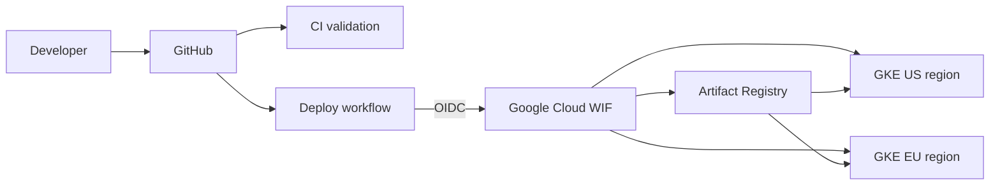

# Multi-Region GKE Application Platform

A production-oriented reference architecture that provisions and deploys a small containerized application across two independent regional Google Kubernetes Engine clusters using Terraform, Artifact Registry, Kustomize, and GitHub Actions CI/CD.

The project demonstrates multi-region deployment. It does **not** implement global traffic management or automated regional failover.



## Overview

Terraform creates a custom VPC, regional subnets with alias IP ranges, two regional GKE clusters, separate autoscaling node pools, one Artifact Registry repository, and GitHub Workload Identity Federation. GitHub Actions builds one commit-SHA-tagged image and rolls that same image out to both clusters. Each cluster exposes an independent regional `LoadBalancer` Service.

## Engineering goals

- Keep infrastructure repeatable, configurable, and reviewable.
- Use short-lived OIDC credentials instead of stored Google Cloud keys.
- Make build and deployment behavior consistent from source to registry to cluster.
- Include baseline health, resource, scaling, rollout, and observability controls.
- State cost and reliability tradeoffs plainly.

## Architecture

The two GKE control planes are regional. To keep temporary demo cost lower, each node pool is placed in one zone; worker nodes are therefore not zonally redundant. Both clusters share a custom-mode VPC but use separate regional subnets and Pod/Service secondary ranges. One regional Artifact Registry repository serves both clusters.

See [Architecture](docs/architecture.md) for the component and delivery details.

## What this project demonstrates

- Google Cloud infrastructure provisioning with Terraform
- Custom VPC and VPC-native GKE networking
- Independent US and EU regional GKE deployments
- Artifact Registry container storage
- Docker image hardening and a deterministic Gunicorn entrypoint
- Kustomize base/overlay configuration
- GitHub Actions CI and sequential multi-cluster delivery
- GitHub OIDC and Google Cloud Workload Identity Federation
- GKE Workload Identity and dedicated node identity
- Kubernetes health probes, resource limits, HPA, PDB, and rollout checks
- Cloud Logging, Cloud Monitoring, operational runbooks, and cleanup guidance

## Technology stack

Google Cloud, GKE, Artifact Registry, IAM, Workload Identity Federation, Terraform, Docker, Kubernetes, Kustomize, GitHub Actions, Python, Flask, and Gunicorn.

## Repository structure

```text
.
├── .github/workflows/
│   ├── ci.yml
│   └── deploy.yml
├── app/
│   ├── tests/
│   ├── .dockerignore
│   ├── Dockerfile
│   ├── app.py
│   └── requirements.txt
├── kubernetes/
│   ├── base/
│   └── overlays/{us,eu}/
├── terraform/
│   ├── github-oidc.tf
│   ├── main.tf
│   ├── outputs.tf
│   ├── providers.tf
│   ├── terraform.tfvars.example
│   ├── variables.tf
│   └── versions.tf
└── docs/
```

## Infrastructure provisioning

Prerequisites:

- Terraform 1.5 or newer, below 2.0
- Google Cloud CLI authenticated to a project with permission to enable APIs and create the documented resources
- an active billing account attached to that project
- Docker and `kubectl` for local validation or manual deployment

Create a local variable file and edit its placeholders:

```bash
cp terraform/terraform.tfvars.example terraform/terraform.tfvars
gcloud auth application-default login
terraform -chdir=terraform init
terraform -chdir=terraform fmt -check -recursive
terraform -chdir=terraform validate
terraform -chdir=terraform plan -out=tfplan
terraform -chdir=terraform apply tfplan
```

`terraform.tfvars`, state, and plan files are ignored. For shared or durable environments, configure an authenticated remote backend before applying; this repository intentionally does not assume an existing state bucket.

## CI/CD pipeline

`CI` runs on pull requests and pushes to `main`. It executes application tests, validates a Docker build, checks and validates Terraform, and renders/validates both Kubernetes overlays.

`Deploy` runs for relevant changes on `main` or by manual dispatch. It authenticates through OIDC, pushes an immutable `${{ github.sha }}` tag to Artifact Registry, applies the US overlay, verifies that rollout, then repeats for EU. It never deploys `latest`.

After `terraform apply`, configure these GitHub repository or protected `production` environment variables:

| Variable | Source |
| --- | --- |
| `GCP_PROJECT_ID` | Terraform `project_id` |
| `GAR_LOCATION` | `artifact_registry_location` |
| `GAR_REPOSITORY` | `artifact_registry_repository` |
| `GKE_US_CLUSTER` | `terraform output -json gke_clusters` → `us.name` |
| `GKE_US_LOCATION` | `terraform output -json gke_clusters` → `us.location` |
| `GKE_EU_CLUSTER` | `terraform output -json gke_clusters` → `eu.name` |
| `GKE_EU_LOCATION` | `terraform output -json gke_clusters` → `eu.location` |
| `WIF_PROVIDER` | `terraform output -raw github_workload_identity_provider` |
| `WIF_SERVICE_ACCOUNT` | `terraform output -raw github_deployer_service_account` |

These are identifiers/configuration, not credentials. No Google service account key secret is needed. Protect `main` and configure required reviewers on the GitHub `production` environment if deployment approval is desired.

## Kubernetes deployment

The base includes a Namespace, Deployment, public Service, HorizontalPodAutoscaler, and PodDisruptionBudget. US and EU overlays set the deployment identity returned by the app.

To render an overlay locally:

```bash
kubectl kustomize kubernetes/overlays/us
kubectl kustomize kubernetes/overlays/eu
```

Deployment replaces the `APP_IMAGE` render placeholder with the full immutable Artifact Registry URI before applying. See [Operations](docs/operations.md) for manual deployment, validation, logs, troubleshooting, and rollback.

## Security

GitHub Actions exchanges its repository/ref-bound OIDC token for short-lived Google Cloud credentials. The container runs as non-root, the Pod has a read-only root filesystem and no service account token, and GKE nodes use a dedicated service account. The implementation and explicit gaps are documented in [Security](docs/security.md).

## Reliability and observability

Each regional deployment has two replicas, rolling updates, readiness/liveness probes, a disruption budget, Pod autoscaling, and resource requests/limits. Node pools use autoscaling, auto-repair, and auto-upgrade. GKE system/workload logging, system monitoring, and managed Prometheus collection are enabled.

These controls improve regional operation but do not create cross-region failover. The application exposes `/healthz`; it does not yet expose custom metrics or define alerts.

## Cost considerations

Two GKE clusters, nodes/disks, two public load balancers, Artifact Registry storage and cross-region pulls, networking, and telemetry can all incur charges. Default sizing is intentionally modest, but this is not a free architecture. Read [Cost considerations](docs/cost.md) and destroy temporary infrastructure after evidence is captured.

## Getting started

Run the application locally:

```bash
python3 -m venv .venv
source .venv/bin/activate
python -m pip install -r app/requirements.txt
python -m unittest discover -s app/tests -v
python app/app.py
```

Then open `http://localhost:8080/` and `http://localhost:8080/healthz`.

Build and test the container:

```bash
docker build -t multi-region-gke-app:local app
docker run --rm -p 8080:8080 multi-region-gke-app:local
```

## Validation

Local/static validation does not prove a cloud deployment. Before presenting the project, complete a real Terraform plan/apply, a successful GitHub deployment, cluster health checks, and endpoint tests in both regions. Use [Portfolio evidence](docs/PORTFOLIO_EVIDENCE.md) to capture defensible proof without exposing sensitive data.

## Cleanup

Use the same Terraform working directory and state that created the resources:

```bash
terraform -chdir=terraform plan -destroy -out=destroy.tfplan
terraform -chdir=terraform apply destroy.tfplan
```

If cluster deletion protection was enabled, set it to `false` and apply before destroying. Enabled project APIs remain enabled by design. Confirm that load balancer resources, clusters, and Artifact Registry are removed to stop related charges.

## Known limitations

- No global load balancer, DNS steering, or automated regional failover
- Independent public regional endpoints with no TLS/domain configuration
- Single-zone worker pools inside regional clusters
- Public rather than private GKE nodes
- One regional Artifact Registry, causing cross-region pulls
- Local Terraform state by default
- No network policy, policy controller, image signing, backup, SLO, or alerting configuration
- No live deployment evidence is committed

## Future improvements

For a real production adaptation, evaluate multi-cluster global traffic management, multi-zone workers, private nodes and Cloud NAT, remote state, TLS, workload-level IAM bindings, admission controls, signed images, application metrics/alerts, and tested backup/recovery procedures. Add only the controls justified by actual requirements.

## Documentation

- [Architecture](docs/architecture.md)
- [Security](docs/security.md)
- [Operations](docs/operations.md)
- [Cost considerations](docs/cost.md)
- [Portfolio evidence checklist](docs/PORTFOLIO_EVIDENCE.md)
- [Portfolio modernization changelog](docs/CHANGELOG_PORTFOLIO.md)

## License

Licensed under the [MIT License](LICENSE).
