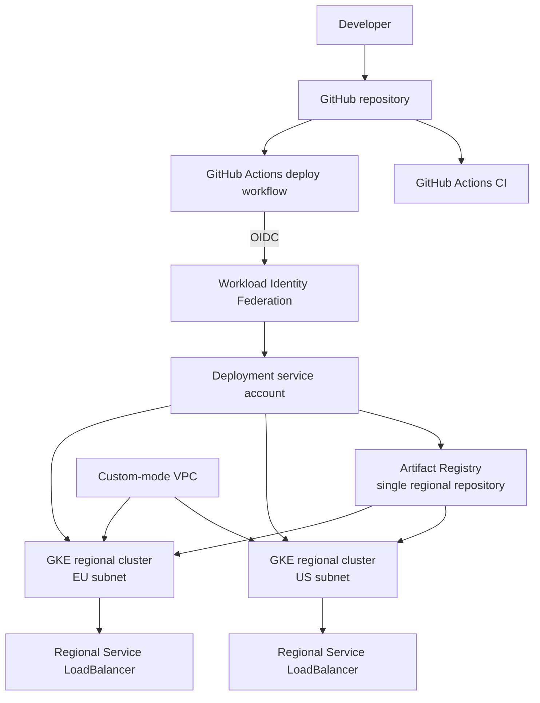

# Architecture

## Problem statement

This repository demonstrates a small application delivered to two independent regional Google Kubernetes Engine (GKE) clusters. It is a production-oriented reference architecture for infrastructure, container, Kubernetes, and delivery practices; it is not a complete globally resilient platform.

## Goals

- Provision repeatable Google Cloud infrastructure with Terraform.
- Build one immutable container image and deploy the same commit-SHA tag to both regions.
- Authenticate GitHub Actions without a stored Google Cloud service account key.
- Include practical health, scaling, rollout, logging, and cleanup controls.
- Keep the application and platform understandable and affordable enough for temporary portfolio use.

## Implemented architecture

Terraform creates one custom-mode VPC and a regional subnet for each cluster. Each subnet has separate secondary IP ranges for Pods and Services. Both clusters use VPC-native networking, a regular release channel, GKE Workload Identity, Cloud Logging, Cloud Monitoring, and managed collection for Prometheus.

The clusters have regional control planes, but each cost-conscious demo node pool is intentionally placed in one zone. This does not provide zonal node redundancy. Each cluster exposes its own application endpoint through a separate Kubernetes `LoadBalancer` Service.

## Deployment flow

1. CI tests the Flask application, validates the Docker build, Terraform, and both Kustomize overlays.
2. On an eligible `main` change, GitHub requests an OIDC token.
3. Google Cloud Workload Identity Federation accepts only tokens for the configured repository and `main` branch, then permits impersonation of the deployment service account.
4. The workflow builds and pushes a commit-SHA-tagged image to Artifact Registry.
5. The workflow applies the US overlay and waits for the Deployment rollout.
6. It repeats the apply and rollout verification against the EU cluster.

The two regional deployments use the same image tag. Region overlays set `DEPLOYMENT_REGION` so the response identifies the serving deployment.

## Authentication and IAM

The GitHub deployer service account has project-level `artifactregistry.writer` and `container.developer` roles. Its impersonation binding is restricted to the configured GitHub repository; the OIDC provider additionally restricts tokens to `refs/heads/main`.

GKE nodes use a dedicated service account with Artifact Registry read, logging, monitoring, and resource-metadata roles. GKE Workload Identity is enabled for future workloads that need Google API access. The sample application itself needs no Google Cloud API permissions and does not receive a Kubernetes service account token.

## Observability

GKE system and workload logging are enabled, along with system monitoring and managed Prometheus collection. Kubernetes probes provide health signals and rollouts are verified in CI/CD. The sample application does not yet expose Prometheus metrics or define alerting policies.

## Known limitations

- There is no global load balancer, DNS steering, health-based traffic routing, or automated regional failover.
- Each cluster has an independent public `LoadBalancer` endpoint.
- Nodes are not private and each regional node pool uses one zone to control demo cost.
- Artifact Registry is in one region, so the other region performs cross-region image pulls.
- Terraform state is local unless the operator supplies a backend configuration.
- Terraform creates broad project-level predefined roles for deployment; a production environment should consider custom roles and environment separation.
- No TLS certificate, domain, policy controller, network policy, backup, SLO, or alert is configured.

## Possible future enhancements

For a real production deployment, evaluate global external Application Load Balancing with multi-cluster services, private nodes plus Cloud NAT, multi-zonal node placement, regional or replicated image storage, remote Terraform state with locking controls, admission policy, application metrics and alerts, TLS, and tested disaster-recovery procedures.
